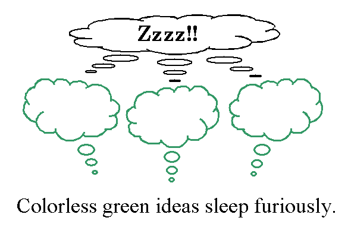

<!-- .slide: class="center" -->
## Syntax

---

## Produktivität

- Unendliche Sätze!
- Wir können eine unendliche Zahl von Sätze bilden.
    - *I like turtles.*
    - *I said that I like turtles*.
    - *The chicken observed that I said that I like turtles.*
    - *The cat remarked that the chicken observed that I said that I like turtles.*

---

## E vs. I Sprache

- I-sprache - Kompetenz
    + Wir können eine unendliche Zahl von Sätze bilden.
- E-sprache = Performanz
    + Aber, es ist nicht möglich jeder grammatischen Satz zu verstehen.

---

## Semantische Plausibilität

- Manche Sätze sind syntaktsich Wohlgeformt, aber haben keine klare semantische Bedeutung!

*Colourless green ideas sleep furiously* <!-- .element: class="example" -->

-----
<!-- .slide: class="center" -->

## Morphologie

---

## Typen

- Usuellen Bildungen
- Okkasionellen Bildungen
- Potentiellen Bildungen

---

## Usuallen Bildungen

- Usuellen Bildungen, 
    - allgemein gebräuchlich: *waschbar, wüstentauglich, unverzweigt, zwischenfingern, Augenblick, Faustregel, Mauerblümchen*

---

## Okkasionellen Bildungen

- aufgetreten und verständlich, aber nicht allgemein gebräuchlich.
- Auch *Neologismen* gennant.
- Bespielen:
    + *unbeichtbar* (Süddeutsche Zeitung 29.10.2003)
    + *Unterwegsbahnhöfe*
    + *unplattbar* (Coca-Cola Werbung)
    + *Mauermord*

---

## Potentiellen Bildungen, 

- möglich und verständlich, wahrscheinlich aber noch nie gebildet wurden. 
- Beispielen: 
    - *Litschischäler*
    - *Streichelmade* 
    - *entgrätbar*
    - *entwatten*
    - *messern*
    - *zwergig* 
    - *sternig*

---

## Okkasionell vs. Potentiell

- Die Unterscheidung okkasionell / potentiell ist für die Sprachbeschreibung nicht besonders relevant.
- Ein potentielles Wort kann durch einfache Äußerung in ein okkasionelles
überführt werden. Beide werden verstanden aufgrund von allgemeinen Prinzipien. 
- Okkasionelle Bildungen, die nur einmal vorkommen, werden als **hapax legomena** bezeichnet.

---

## Usuell, okkasionell, potentiell?

<!-- .slide: class="small" -->

S|2008 |2019 |S |2008| 2019
---|---|---|---|---|---
*Einsamkeit*| 2500000| 14.400.000 |*Neunsamkeit*| 24| 232
*Zweisamkeit*| 817000| 5.860.000 |*Zehnsamkeit*| 9 |9
*Dreisamkeit* |9650| 40.200| *Elfsamkeit*| 3| 4
*Viersamkeit*| 1300| 29.500 |*Zwölfsamkeit* |2 |53
*Fünfsamkeit*| 169| 2000 |*Dreizehnsamkeit*| 1| 3
*Sechsamkeit*| 47| 529 |*Vierzehnsamkeit* |0 |1
*Siebensamkeit* |9| 98 |*Fünfzehnsamkeit*| 2| 3
*Achtsamkeit*| 932000 (!) |17.000.000| 

---

## Regelen und Kreativität

- Worbildungen sind oft kreative **Wortschöpfungen**.
- Das kann sich auf die Bedeutung von komplexen Wörtern beziehen, die sich aus der Situation der Erstverwendung ergeben Beispiel: 
    - *Pillenknick*, der Rückgang der Geburtenrate nach Einführung von Kontrazeptiven, 
    - *Sommermärchen* als Bezeichnung für die Fußball-WM 2006 in Deutschland.

Note:
Wortschopfungen: Ein Unterschied zu syntaktischen Regeln.

---

## Regeln und Kreativität

- Oft bezieht es sich auf neue Konzepte, die sich gesellschaftlich / wirtschaftlich etablieren, z.B.:
    -  *Regenbogenfamilie*, Familienformen die nicht dem klassichen Muster entsprechen, ähnlich auch das *Mehrgenerationenhaus*.

---

## Regeln und Kreativität

- Das kann sich auf die Wortform selbst beziehen, siehe *unkaputtbar* für Plastikflaschen 423,000 Treffer bei Google, *Unkaputtbarkeit* ca. 5300 Treffer. 

- Im Englischen wurde der Begriff *motherese* für die Sprechweise der Mütter mit Kleinkindern eingeführt (vgl. *Vietnam – Vietnamese*). 

Note:
No idea what the first refers to. Skip over :-)
The second is taking the suffix, and applying to mother.

---

## Regeln und Kreativität

- Letzteres gibt es auch in der Syntax: *Hier werden Sie geholfen* (Telekomwerbung von Verena Poth, 
    - Regelverstoß: keine Passivierung von Dativen) 
    - Erklärung: Manchmal macht gerade der gezielte Regelverstoß Ausdrücke so attraktiv, dass sie kopiert werden.

Note:
In German, you can't usually passivise the dative object in a normal way (dative must be realised).
But here, it is done!

---

### Analogie als Interpretationsprinzip

- Bei regulären Wortbildungen gibt es neben der Wortbildungsregel eine entsprechende Bedeutungsregel. 
    + *Ge*+Verb+*e*: 'Die Tätigkeit, die durch das Verb ausgedrückt wird, in übergroßem Maße ausgeführt und daher möglicherweise als störend empfunden': *Geschmatze*
    + Nomen+*los*: 'die Eigenschaft, ohne Entitäten zu sein, die in die Extension des Nomens fallen', vgl. *rhododendronlose Gärten*

Note: 
Big Question for the slide: - Wie erhalten Worbildungen und Wortschöpfungen ihre Bedeutung?

-----

<!-- .slide: class="center" -->
## Beschränkung von Wortbildung

---

## Phonologische Beschränkungen: Repitition

- Eine häufige Beschränkung ist die Vermeidung von Repetitionen (Haplologie):
    + *Arbeiter-in*, aber: **Zaubererin*, stattdessen: *Zauber-in* (Subtraktion von *-er*),
    + **Plappererin*, stattdessen: *Plapperin* usw.
    + **Morphophonologie*, stattdessen *Morphonologie*
    + **Mineralologie*, stattdessen *Mineralogie*
    + **honigig*, **essigig*
    + Spanisch: *mesa, mesilla* 'kleiner Tisch', aber: *gallo*, **gallillo* 'kleiner Hahn'

---

## Phonologische Beschränkungen: Rythmus

- Ausschluss rhythmischer Muster mit Folgen von schwerem Akzent:
    + *glóbal, glóbalize, aber corrúpt, *corrúptíze.*

---

## Phonologische Beschränkungen: Phonotactics

- phonotaktische Beschränkungen, z.B. bei der Verteilung von *-chen* und *-lein*: 
    - *-chen* wird nicht an Nomen angehängt, die auf *-ch* enden, 
    - *-lein* nicht an Nomen, die auf *-l* enden.

- **Büchchen* 
- **Spiellein*

---

## Semantische Restriktionen
- Die durch die morphologische Regel ausgedrückte Bedeutung muss sinnvoll sein. Beispiel:
- Russische Eigenschaftsnomina auf *–stvo* nur mit Adjektiven, die sich auf Eigenschaften beziehen, welche präsupponieren, dass sie auf Menschen zutreffen:
    - *bogatyi* ‘reich’, *bogat-stvo* ‘Reichtum’, *udaloj* ‘mutig’, *udal’-stvo* ‘Mut’ 
    - *krasivyi* ‘schön’, **krasiv-stvo*, *priemlemyi* ‘akzeptabel’, **priemlem-stvo*

Note: 
The nouns must apply to *human* characteristics.
mutig = brave, Mut = courage
schön und akzeptabel both have a wider usage

---

## Semantische Restriktionen

- Die Suffix *–in* ist für Bezeichnungen von Menschen oder höhere Tiere gebräuchlich, nicht aber für niedere Tiere:
    - *Bäuerin, Präsidentin, Löwin, Rättin, *Finkin, *Hechtin, *Käferin*

Note:
Hecht = pike, Fink = finch, Kafer = beetle

---

## Morphologische Restriktionen
- Die *Ge-*+Verb+*e*-Derivation ist produktiv, die *Ge*+Nomen-Derivation nicht:
    - Gerenne, Geradle, Gefernsehe, Geatme, Geöffne, Gehasse, Geglaube, ...
    - *Gewölk*, *Gebälk*, *Gestühl*, *Gehäuse*, *?Gebäum(e)*, **Geschränk*, **Geteppich(e)*

- Dies spricht dafür, dass zumindest manche morphologische Regeln grundsätzlich anderer Natur sind als syntaktische Regeln.

---

## Morphologische Restriktionen

- Manchmal erwartet eine morphologische Regel, dass auf den Stamm zunächst eine andere angewendet worden ist. Besipiel: 
- Russisch *-ja* für feminine Nomina erwartet Agentivnomen *-un*.
    - *govor-it’* ‘sprechen’, *govor-un* ‘Sprecher, jmd. der spricht’, *govor-un-ja* ‘Sprecherin’, *lg-at’* ‘lügen’, *lg-un* ‘Lügner’, *lg-un’-ja* ‘Lügnerin’

---

## Syntaktische Restriktionen

- Wortbildungsverfahren können auf bestimmte syntaktische Klassen beschränkt sein, z.B. Passivbildung nur für transitive Verben.
    + **Hier werden Sie bedient.*
    + **Hier werden Sie geholfen.*

---

## Wortherkunftsrestriktionen
- Beispiel: Englisch in- vs. un- für die lateinische/romanischen vs. germanische Stämme:
    - *unhealthy, unbelievable* vs. *infrequent, invisible*
- Beispiel: Deutsch: lateinische Suffixe für lateinische Stämme
    + Konsulat, Telefonat (atus &gt; at)
    + Kommissar, Justiziar (arius &gt; ar)
    + Kompressor, Ventilator (tor &gt; (t)or)
    + Kultur, Figur, Signatur (ura &gt; ur)
    + agitieren (itare &gt; ieren)

---

## Blockierungseffekte
- Wenn eine Bedeutung bereits durch ein etabliertes Wort gebildet ist, blockiert dieses die Entstehung von morphologisch abgeleiteten Wörtern mit derselben Bedeutung.
    - Löwin, aber *Kätzin, da durch Katze blockiert, *Pferdin, da durch Stute blockiert ähnlich *Stehler (durch Dieb blockiert), *lobbar (durch löblich blockiert), *Missproportion, *Missharmonie (durch Disproportion, Disharmonie blockiert), *Messer (*jemand, der misst, blockiert durch die gebräuchliche Verwendung als Besteck)

---

## Blockierungseffekte

- Auch wenn ein Wort mit unterschiedlicher Bedeutung existiert, kann es zu Blockierung kommen:
    - schauen, Schauer (‘jemand der schaut’, aber meist nur in Bedeutung: ‘starker plötzlicher Regenfall’)

- **Aktuell**: Blockierung von *Studenten* durch *Studierende*
-  *Studenten* =/= geschlechterneutral, 
-  *Studierende* = geschlechterneutral (als Partizip I)
-  allerdings ist der Bedeutungsunterschied nicht jedem transparent.

---

## Blockierungseffekte

- Bei synonymen Bildungen Tendenz zu Lexikalisierung, vgl. Ableitungen mit *-bar* und *-lich*, wobei letztere stärker lexikalisiert sind; Synonymie bei ko-okkurierenden Formen zwischen entlehnten und nicht-entlehnten Affixen.
    - *unsäglich/unsagbar*, *unmerklich/unmerkbar*, *zerbrechlich/zerbrechbar*,
*verkäulich/verkaufbar*
    - *Extraausgabe/Sonderausgabe*, *inakzeptable/unannehmbar*
