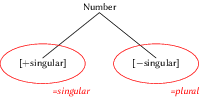
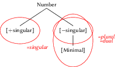
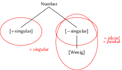
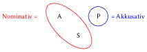
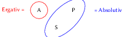
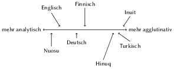
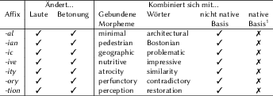
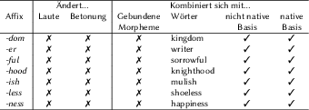
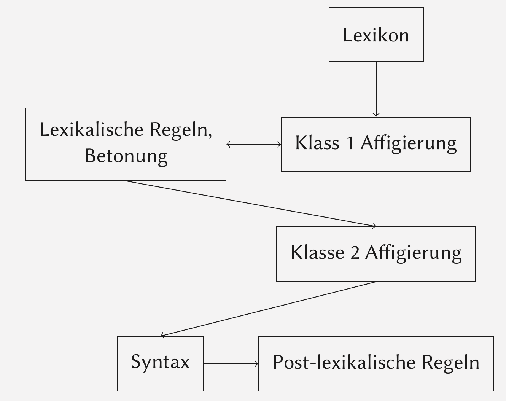
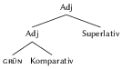

<!-- .slide: class="center" --> 
## Einleitung

---

## Einleitung

- Was verstehen wir über "Wort"?
- Der Konzepten 'Wort' und 'Morpheme'.
    - Probleme mit der Defintion von "Wort".
- Typen der Affixe

-----

<!-- .slide: class="center" -->
## Typologie I: Merkmale der Substantive

---

## Typologie I

Flexionsmorphologie für Substantive

- Typologie des Numerus: was bedeutet singular, dual, plural, paucual?
- Merkmale des Numerus
- Typologie des Persons: was bedeutet 1.incl-, 1.excl-, 2.- und 3.Person?
- Merkmale des Persons: [±Sprecher], [±Zuhörer]
- Typologie des Kasus (Nominativ-Akkusativ, Ergativ-Absolutiv, Tripartite Systeme) und Numerus.

---

## Typologie I: Merkmale des Numerus

- [±singular]: eine oder mehr als eine Einheit.
- [Minimal]: der Kleinste Gruppe
- [Wenig]: eine kleine Gruppe

[−singular] + [Minimal] = DUAL = ''die kleinste Gruppe, die [−singular] ist''

[−singular] + [Wenig] = PAUKAL = ''eine Kleine Gruppe, die [-singular] ist''.

---

## Singular vs. Plural

 <!-- .element: class="img2" -->

---

## Singular vs. Plural vs. Dual

 <!-- .element: class="img2" -->

---

## Singular vs. Plural vs. Paukal

 <!-- .element: class="img2" -->

---

## Typologie I: Person

- [±Sprecher] = Die Gruppe enthält (nicht) den Sprecher.
- [±Zuhörer] = Die Gruppe enthält (nicht) den Zuhörer.
- Maori:

Merkmale                |   Pronomen  |  Kategorie
---|---|---
[+Sprecher,−Zuhörer]      |   au/taatou           |   1.excl
[+Sprecher,−Zuhörer]    |   maatou          |   1.incl.
[−Sprecher,+Zuhörer]      |   koe/koorua      |  2
[−Sprecher,−Zuhörer]     |  ia/raatou           |  3

---

## Typologie I: Kasus

In eine Nominative-Akkusativ Sprache haben die A- und S-Argumente den gleichen Kasus.

Das P-Argument ist anders.

<!-- .element: class="img2" -->

---

## Typologie I: Kasus

In eine ergative-absolutiv Sprache haben die S- und P-Argumente den gleichen Kasus.

Das A-Argument ist anders.

<!-- .element: class="img2" -->

---

## Typologie I: Kasus

In eine tripartite Sprache haben alle Arguemente verschiedene Kasus.

<!-- .element: class="img2" -->

-----

<!-- .slide: class="center" -->
## Typologie II

---

## Typologie II: Analytisch vs. Synthetisch

Der Unterschied zwischen Analytische und Synthetische Sprachen.
    
- Eine analytische Sprache hat sehr wenig Morpholgie. Es gibt oft keine oder minimale Flexsionsmorphologie, und die meisten Wörter haben ein kleines Morphem zu Wort Verhältnis.
- Synthetischen Sprachen haben Flexionmorphologie und viele Präfixe und Suffixe (und vielleicht Infixe oder Circumfixe).

---

## Typologie II: Agglutinativ vs. Fusional

Der Unterschied zwischen Aggluntinative und Fusionale Sprachen.

Eine Sprache ist **agglutinativ**, wenn es zahlreichen Morpheme pro Wort gibt und jedes Morpheme eine einzige Kategorie ausdrückt.

---

## Typologie II: Agglutinative

Finnisch|Daten
----|----
auto-ssa            |   in einem Auto
auto-i-ssa          |   in die Autos
auto-ssa-si         |   in deinem Auto
auto-si             |   deinem Auto
auto-kin            |   ein/das Auto auch
auto-si-kin         |   dein Auto auch
auto-ssa-kin        |   in einem/dem Auto auch
auto-i-ssa-kin      |   in den Autos auch
auto-i-ssa-si-kin   |   in deinen Autos auch

---

## Typologie II: Fusional

In fusionale Sprache sind Wörter auch komplex mit zahlreiche Morpheme pro Wort. 

Die verschiedene Kategorien werden in einem einzigen Morphem ausgedrückt.

Kasus   |   Maskulinum  |   Femininum   |   Neutrum
---|---|---|---
nom   |   ein     |   eine        |   ein 
akk   |   einen   |   eine       |   ein 
dat  |   einem   |  einer       | einem
gen  |   eines   |   einer       |   eines

---

## Typologie II: Continuum

Die Typologie hier ist nicht absolut. 

Es gibt keine Sprache, die ganz anlytisch ist, ganz synthetisch oder ganz fusional.

Diese Kategorien sind nur Tendenzen.

<!-- .element: class="img2"-->

-----

<!-- .slide: class="center" -->
## Derivation

---

## Derivation

Reihenfolgebeschränkungen der Affixe - warum?

Der Kopf

Der Unterscheid zwischen Flexions- und Derivationsmorphologie.

---

## Typologie II: Reihenfolge

**hopelessness, *hopenessless, worthlessness, *worthnessless**

- *-less* ist ein Suffix, das mit einem Substantiv kombiniert werden muss. Das Ergebnis ist ein Adjektiv.
- *-ness* ist ein Suffix, das mit einem Adjektiv kombiniert werden muss. Das Ergebnis ist ein Substantiv.

---

## Derivation: Der Kopf

Die Bedeutung eines Wortes ist aus den Bedeutungen aller Morpheme zusammengesetzt.

Die grammatischen Eigenschafen kommen aber nur von einem
Morphem!

Das Affix, das die grammatischen Eigenschaften bestimmt, heißt der Kopf.

---

## Derivation: Der Kopf

Niederländisch hat zwei Genera. Wir nennen diese Genera *Common* und *Neutrum*.

Die Wahl des definiten Artikels  hängt von dem Genus ab.

**Common**: *de kikker* 'der Frosch', *de uil* 'die Eule' 

**Neutrum**: *het monster* 'Das Monster', *het huis* 'Das Haus'

---

## Typologie II: Der Kopf

Das Diminutiv bildet immer ein Substantiv, das Neutrum ist.

*het kikker-tje* 'der Frosch-dim'

*het monster-tje* 'Das Monster-dim'

*het ommetje* 'ein kleiner Spaziergang' (lit. 'der um-dim')

Es ist klar, dass das Diminutivsuffix der Kopf ist.

Es bestimmt die morphologische Eigenschaften der ganzen Form.

-----

<!-- .slide: class="center" -->
## Komposition

---

## Komposition

- Die Bedeutung eines Kompositums ist beschränkter als die Kombination der Morpheme.
- Nuclear Stress Rule und Compound Stress Rule.
- Komposita und der Kopf - was ist der Kopf? Veränderungen...
- Endo- und Exozentrisches Komposita

---

## Komposita: der Kopf

Teil 1      |   Kategorie   |   Teil 2      |   Kategorie   |   Kompositum
----|----|----|----|----
black       |   Adj     |   board   |    S       |  S
rattle      |   V       |   snake   |    S       |   S
over        |   P       |   dose     |    V     |     V
dog     |  S       |  house   |   S       | S

---

## Komposita: der Kopf

Teil 1      |   Genus   |   Teil 2      |   Genus   |   Kompositum
---|---|---|---|---
Raub        |   m       |   Kopie   |    f       |   f
Buch        |   n       |   Laden   |    m   |    m
Not     |   f       |   Arzt        |    m   |    m
Brief       |   m       |   Papier  |    n       |    n
Schwester   |   f       |   Heim        |    n       |    n
Konto   |   n           |   Nummer  |    f       |    f

---

## Komposita: Kopf Veränderungen

Komposita in Hebräisch sind links-köpfig.

Teil 1  |   Bed         |   K   |   Teil 2      |    Bed        |   K   |  Kompositum      |   K
---|---|---|---|---|---|---|---
yom |   'Tag'           |   S   |   tov     |   'gut'       |   Adj |   yom-tov             |    S |'Urlaub' 
kesef |'Geld'      |    S   |   katan   |  'klein' |   Adj |   kesef-katan     |    S | 'Kleingeld' |

---

## Komposita: Exozentrisch

Exozentrische Komposita sind Komposita, die keinen klaren Kopf haben.

Endozentrische Komposita haben einen klaren Kopf.

---

## Exozentrisch: Spansich

Num | Kompositum              |   Bedeutung
---|---|---
a.  |   el lava-plato-s         |  'die Spülmaschine'  
    |   der waschen-Geschirr-pl  |   
b.  |   el abre-lata-s          |  'der Dosenöffner'
    |   der öffnen-Dose-pl   |   
c.  |   el rasca-cielo-s            |   'der Wolkenkratzer'
    |   der kratzen-Himmel-pl     |   
d.  |   el cata-vino-s          |   'der Weinprober'
    |   der proben-Wein-pl  |   

-----

<!-- .slide: class="center" -->
## Allomorphie

---

## Allomorphie

- Was bedeutet 'Allomorphie'?
- Phonologische Allomorphie versus morphologische Allomorphie?
- Exponent versus Allomorph.

---

## Allomorphie: Bedeutung

Allomorphie bedeutet, dass es zwei oder mehr Exponenten von einem Morphem gibt und die Wahl der Exponentes von anderen Morphemen des Worts bestimmt wird.

- *-en*: die Studenten, die Themen.
- *-e*: die Friseure, die Hände
- *-er*: die Wörter
- *-s*: die Autos, die Hobbys
- *keine*: die Löffel

---

## Allomorphie: Exponent/Allomorph

- Exponent: Die zugrundeliegende Form eines Morphemes.
- Allomorph: verschiedene Formen eines bestimmten Morphems.

---

## Phonologisch bestimmt

1.sg    |   2.sg    |   3.sg    |   Verb
---|---|---|---
i:rek       |   i:r**s**       |   i:r     |   'schreiben'
seretek |   seret**s** |   seret       |   'lieben'
bese:lek    |   bese:l**s**    |  bese:l  |   'sprechen'
ke:rek  |   ke:r**s**      |   ke:r        |   'fragen'
verek   |   ver**s**       |   ver     |   'schlagen'
vesek   |   ves**el**      |   ves     |   'kaufen'
ne:zek  |   ne:z**el** |   ne:z        |   'suchen'

---

## Morphologisch bestimmt

Adjektive       |   Komparativ |    Sprache
---|---|---
good            |   bett-er |   Englisch
god         |   bed-re  |   Dänisch
špatn-ý |   hor-ši  |   Tschechisch
asko            |   gehi-ago    |   Baskisch
šig'        |   pɛr'-am | Kildin Saami

Es gibt kein phonologisches Kriterium, das die Form der Wurzel bestimmt.

-----
<!-- .slide: class="center" -->
## Exotisches Morphologie

---

## Exotisches Morphologie

- Was ist der Ursprung eines Infixes (i.e. was sind die Beschränkungen?)
- Wie größ ist das Reduplikationsmorphem?
- Wo befindet sich die Reduplikationsmorphem (i.e. die Typologie der Reduplikationsschablonen)?

---

## Infigierung: Oaxaca Chontal

Singular        |   Bedeutung           |   Plural              |   Bedeutung
---|---|---|---
cece            |   'Eichhörnchen'      |   cełce           |   `Eichhörnchen
tuwa            |   'Ausländer' (sg)          |   tułwa           |   `Ausländer' (pl)
teʔ |   `ältere'            |   tełʔ    |   'älteren'
łipo    |   'Opossum'           |   łiłpa       |   'Opossums'

---

## Infigierung: Tagalog

Gegenwarts  |Möglich|   Unmöglich   |   Bedeutung
---|---|---|---
lakad       |linakad|   *lakinad            |   'laufen'
piliʔ   |piniliʔ|   *piliniʔ    |   'wählen'
sulat   |sinulat|       *sulinat            |   'schreiben'
hanap   |hinanap    |   *haninap            |   'suchen'
basa    |binasa|            *basina         |   'lesen'

Der Platz der Infigierung konsistent ist

---

## Infigierung

Man kann sagen, dass *-in* in Tagalog ein Präfix ist, aber manchmal steht es innerhalb einer Wurzel.

Im Tagalog gibt es Präferenz für Wörter, die mit einem Konsonanten beginnen.

Wäre *in* ein Präfix, dann würde das Ergebnis ein vokalinitiales Wort sein. In diesem Szenario verschiebt sich das Präfix in die Wurzel.

Diese Regel ist eine phonologische Regel. Sie heißt Metathese.

---

## Reduplikation: Agta

Singular    |   Plural      |   Bedeutung
---|---|---
takki       |   taktakki        |   'Bein'
labáng  |   lablabáng   |   'Fleck'
wakay   |   wakwakay        |   'Leck'
saddu       |   sadsaddu        |   'verloren Einheit'

Wir sehen, dass der erste Konsonant, der erste Vokal und der zweite Konsonant kopiert werden, um der `Plural'  auszudrücken.

---

## Reduplikation: Marshalleisisch

Form 1                  |   Bedeutung  |   Form 2      |   Bedeutung
---|---|---|---
jæj         |   'schlüpfrig'    |   jæjjæj        |   'sehr schülpfrig'   
lɣŋọŋ   |   'Angst haben'   |   lɣŋọŋŋọŋ    |   'viel Angst haben'
tææŋ          |   'beliebt'       |   tææŋææŋ |   'sehr beliebt'
jituul              |   'Stahl'     |   jituuluul   |   'sehr magnetisch'

---

## Reduplikation: Analyse

- Wir sagen, dass Sprachen eine Schablone für das Morphem haben.
- Diese Schablone ist eine Kombination von leeren Konsonanten (K) und/oder leeren Vokalen (V).
- Diese leeren Laute können keine Aussprache haben, und sie müssen phonologische und phonetische Form bekommen.
- Sie bekommen diese Form von der benachbarten Laute: meistens die Wurzel.

-----
<!-- .slide: class="center" -->
## Lexikalisches Morphologie

---

## Lexikalische Morphologie

- Unterschieden zwischen Klasse I und Klasse II affixe.
- Warum erscheinen Klasse I affixe näher der Wurzel als Klasse II?
- Modell der lexicalischen Morphologie.
- Unterschied zwischen lexikalischen und post-lexiklaischen Regeln.

---

## Klasse I Affixe

 <!-- .element: class="img3" -->

---

## Klasse II Affixe

  <!-- .element: class="img3" -->

---

## Lexikalische Morphologie

<!-- .element: class="img4" -->

-----

<!-- .slide: class="center" -->
## Universalien

---

## Universalien

- Warum gibt es kein ABA Mustern (**gut---besser---am gutsten*) in Komparationsuppletion?

---

Positiv| Komparativ| Superlativ| Muster| Sprache
---|---|---|---|--
**grün** | **grün**-er |(am) **grün**-ste(n)| AAA|
 **gut** |**bess**-er| (am) **bes**-ste(n) | ABB|
**bad**| **worse**| **wors**-st| | (Englisch)
**špatný** | **hor**-ší | nej-**hor**-ší | |(Tschechisch)
**asko**| **gehi**-ago| **gehi**-en| |(Baskisch)
 **bon**-us |**mel**-ior |**opt**-imus| ABC |(Lateinisch)
**da** |**gwell** |**gor**-au| | (Walisisch)

---

## Nicht gefunden aber möglich

Positiv|Komparativ| Superlativ| Muster
---|---|---|---
 gut| gut-er| (am) bes-sten| hypothetisch AAB
 gut| bess-er| (am) gut-sten| hypothetisch ABA

---

## Containment Hypothesis (Bobaljik)

Die Superlativstruktur enthält immer die Komparativstruktur.

<!-- .element: class="img2" -->

---

## *ABA

- Weil der Superlativ immer den Komparativ enthält, muss die mehr spezifische Regel sowohl im Komparativ- als auch Superlativkontext angewendet werden.
- Gleichzeitig kann die wenig-spezifische Regel nicht angewendet werden.
- Folglich kann die Superlativform nie die ''Woanders'' Form haben, wenn die Komparativform eine kontextbedingte Form hat.

